## 

## 📌Self Intro

Hello, I'm psp_dada

- Undergraduate at Harbin Institute of Technology (Shenzhen)
- Enthusiast in Multimodal LLMs, Preference Optimization, Multimodal Agents, and Open Source
- Passionate about academic research and continuous learning
- Always open to innovative collaborations and new opportunities
- Contact: pspdada0808@gmail.com

[Github](https://github.com/pspdada) / [Google Scholar](https://scholar.google.com/citations?user=mKnBrRAAAAAJ) / [ORCID](https://orcid.org/0009-0000-5949-0524) / [OpenReview](https://openreview.net/profile?id=%7EShangpin_Peng1) / [RedNote](https://www.xiaohongshu.com/user/profile/62c6ff3f00000000020025a7) / [Hugging Face](https://huggingface.co/psp-dada) 🤗

## 🔍 More About Me

### 📊 Skills

- **Programming & Tools:**
  

    <object data="https://skillicons.dev/icons?i=py,c,java,bash,pytorch,git,github,vscode,latex,md,arduino,flutter" type="image/svg+xml">
      
    </object>
  

- **Languages:** Chinese (Native) & English
- **Hobbies:** Badminton, Swimming

### 💡 GitHub Stats

  
  

### 🎉 GitHub Visitor Counts

